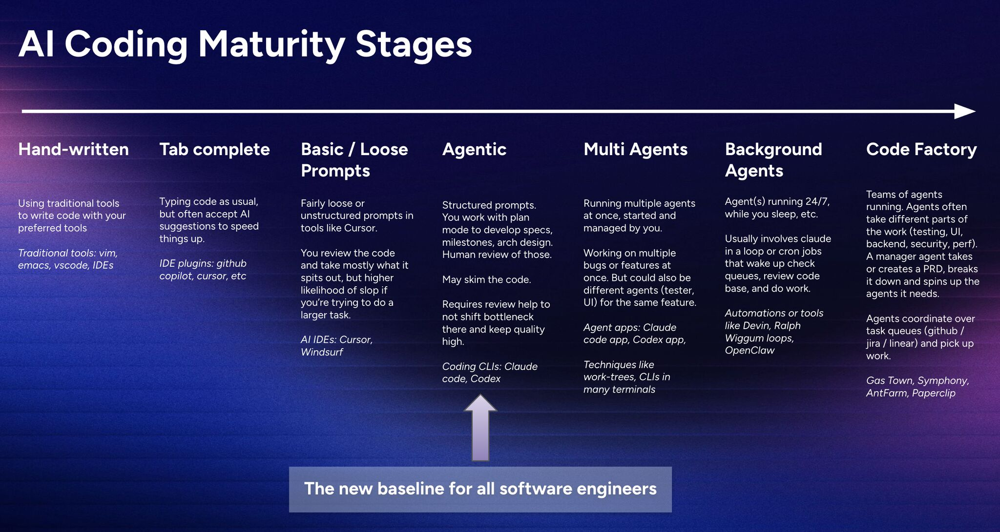

Here's a clean, team-ready breakdown of what this slide is really saying—and how you can apply it to your mobile/Search org:

## Core Idea (TL;DR)

Software engineering is shifting from "writing code" → "orchestrating AI agents."

The slide describes a maturity curve of how engineers evolve with AI.

---

## The 7 Stages

### 1. Hand-written

- You write everything manually
- AI = none

**Baseline:** craftsmanship, but slow

### 2. AI-assisted (Copilot era)

- AI helps autocomplete
- You still think + write everything

**Productivity boost, but mindset unchanged**

### 3. Prompt-driven

- You ask AI to generate chunks of code
- Still loosely structured

**Faster output, but quality inconsistent**

### 4. Agentic (key transition point)

- You define specs, not code
- AI executes tasks based on structured prompts
- You review instead of write

**This is the new baseline for strong engineers**

### 5. Multi-agent

- Multiple agents working in parallel: e.g. UI agent, backend agent, test agent
- You coordinate them

**You become a "task orchestrator"**

### 6. Background agents

- Agents run async (even while you sleep)
- They fix bugs, review code, monitor systems

**Engineering becomes continuous, not session-based**

### 7. Code factory

- Fully automated system: PRD → tasks → agents → execution
- Agents collaborate like a team

**You manage systems, not tickets**

---

## What This Means for Your Team

Given your context:

- Search + ML-driven UX
- Mobile team supporting ranking/retrieval/LLM
- Need for debugging + experimentation infra

You're currently between **Stage 3 → Stage 4** (Prompt → Agentic)

---

## How to Apply This to Your Team

### 1. Shift mindset: "code → spec"

Instead of: *Engineer writes feature*

Move toward: Engineer defines:
- UX intent
- API contract
- ranking signal
- experiment hypothesis

AI generates implementation.

This aligns perfectly with your ML-driven UX vision and experimentation loops.

### 2. Introduce "Agentic workflows" (practical)

Start small — example for your Search team:

| | Before | After |
|---|---|---|
| **Task** | Engineer implements ranking UI change manually | Engineer writes spec (UI + ranking signal) + experiment config |
| **Output** | Manual implementation | AI generates: UI diff, logging hooks, experiment wiring |
| **Role** | Write | Review + iterate |

### 3. Build internal "agents" (this is your leverage)

You already have: debugging tools, shake-to-report, ML support. Turn these into agents:

| Agent | What It Does |
|---|---|
| **Experiment Agent** | Sets up A/B tests automatically |
| **Debug Agent** | Analyzes logs + suggests root cause |
| **UI Agent** | Generates layout variants for ranking experiments |
| **Signal Agent** | Injects tracking (time spent, scroll, etc.) |

This is where your team can lead org-wide.

### 4. Move toward multi-agent (Stage 5)

Example — Feature: "Improve search conversion"

- **Ranking agent** → adjusts model config
- **UI agent** → creates layout variants
- **Analytics agent** → sets up metrics
- **QA agent** → runs test cases

Your engineers coordinate, not implement everything.

### 5. Background automation (huge ROI)

You can unlock this quickly:

**Nightly agents:**
- Analyze experiment results
- Detect regressions
- Suggest improvements

**Continuous:**
- Monitor crash / latency
- Auto-create tickets

This directly ties to your quality issues, lack of testing rigor, and incidents.
