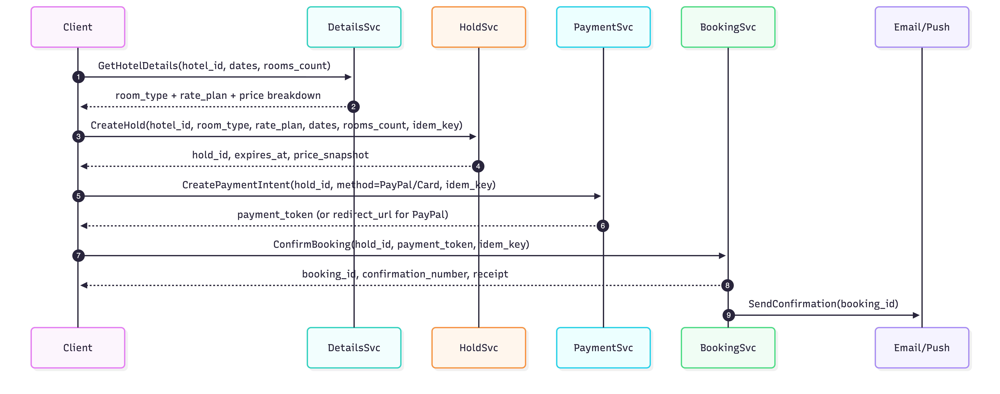
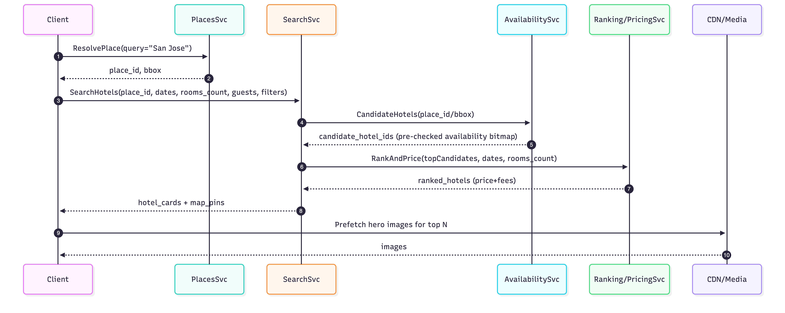
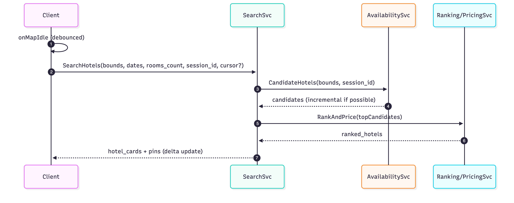

# Hotel Booking Architecture Interview Checklist

## 0) First 60 seconds: align scope & goals
- ☐ Confirm scope: **search → details → book**, login exists, **cancel-only**
- ☐ Inventory source: **internal**
- ☐ Scale: **200M DAU**, rough QPS expectations (search >> booking)
- ☐ UX: city/region search box + **map-drag triggers re-search on every drag end**
- ☐ Booking: **multi-room but single room type selection**
- ☐ Correctness target: **99.99% strict availability**
- ☐ Price display: **fees shown in search results** (estimated vs final?)

---

## 1) Correctness & booking invariants (most important)
**Core invariant:** no confirmed booking without reserved inventory + stable price snapshot

### Booking Flow Diagram

### Cancellation Flow Diagram

- ☐ What does "99.99% strict" mean numerically (oversell budget per million bookings)?
- ☐ Where is the **source of truth** for availability (hold/booking service)?
- ☐ Is “available” in search **advisory** and revalidated at hold time?
- ☐ Define booking state machine: `PENDING → HOLD → CONFIRMED` (+ `CANCELLED/EXPIRED`)
- ☐ Hold TTL: how long, why, and what happens on expiry during payment?
- ☐ Hold atomicity: reserve **all nights** or none (no partial holds)
- ☐ Idempotency keys required for:
  - ☐ CreateHold
  - ☐ ConfirmBooking
  - ☐ CancelBooking
- ☐ Handling payment success but confirm failure (exactly-once semantics, retries, reconciliation)
- ☐ Cancellation behavior: inventory release + refund logic + audit trail
- ☐ Reconciliation: detect/repair inventory drift (scheduled job + alerts)

**Red flags to avoid saying**
- “Search availability is always correct”
- “We can just lock rows for the whole hotel”

---

## 2) Availability representation (bitsets + counters) and edge cases
- ☐ Define authoritative storage: `available_units(hotel, room_type, date)`
- ☐ Search acceleration:
  - ☐ Bitsets per `>=k rooms` for k=1..K (cap K)
  - ☐ Range check by `bitset AND mask == mask`
- ☐ Update strategy for bitsets: synchronous vs near-real-time (and fallback when stale)
- ☐ Cross-month stays: how holds work across partitions (saga/rollback)
- ☐ Contention: last-room race conditions and conditional decrement correctness
- ☐ Expired hold release: time-wheel + sweeper backup, idempotent release
- ☐ “Rollback failed” scenario: how you prevent permanent leakage

---

## 3) Search pipeline & ranking (backend + data flow)

### Search Flow Diagram

- ☐ Two-phase search:
  - ☐ Candidate generation (geo + availability pre-check)
  - ☐ Ranking/pricing only for top candidates
- ☐ Filters supported and where applied (candidate vs ranking vs details)
- ☐ Mixed ranking objectives: conversion + price + distance + business rules
- ☐ Guardrail: ensure ranked results are still holdable (re-check before render / on click)
- ☐ Fees shown at search: estimated vs guaranteed; when do you recompute?
- ☐ Caching strategy for search results (keyed by dates/occupancy/bounds; TTL minutes)

---

## 4) Map-drag UX & performance (frontend + backend contract)
**Goal:** feel instant, not melt QPS

### Map Search Flow Diagram

### Frontend / Mobile
- ☐ Trigger only on **drag end (onIdle)** + debounce (250–400ms)
- ☐ Cancel in-flight requests; “latest wins” policy
- ☐ Ignore tiny bounds changes (delta threshold)
- ☐ Keep old results until new ones arrive (avoid blanking)
- ☐ Progressive rendering (pins first, list later) if supported
- ☐ Telemetry: drag frequency, searches/session, latency, cancellations

### Backend
- ☐ Spatial cache: snap bounds to cells (S2/H3/geohash) + short TTL
- ☐ Session token to reuse candidate sets and rate-limit per session
- ☐ Load shedding plan: pins-only / cached-only responses during spikes

---

## 5) Autocomplete & place resolution (frontend + storage)
### Frontend
- ☐ Keystroke latency target (e.g., <50ms locally)
- ☐ 3-layer pipeline:
  - ☐ Local popular places (instant)
  - ☐ Optional local history boost
  - ☐ Network refinement for long tail
- ☐ Debounce network calls and cancel stale requests
- ☐ Merge + dedupe suggestions by place_id, stable ordering (avoid flicker)

### Storage choices
- ☐ Trie vs **Compact FST** vs SQLite: why your choice matches constraints
- ☐ Update approach: versioned blob + overlay delta (no full rebuild)
- ☐ Aliases handling (e.g., “SF”, “NYC”) and multilingual names

---

## 6) Frontend app architecture & state management (web + mobile)
- ☐ Define screen-level state machines:
  - ☐ Search: typing → loading → results → map idle → reloading
  - ☐ Booking: selecting → holding → paying → confirmed/failed/expired
- ☐ Data fetching pattern: repository + caching + cancellation tokens (per query)
- ☐ Caching rules (frontend):
  - ☐ Cache: places, hotel details/photos, images
  - ☐ Don’t cache: availability authoritatively (only show snapshots)
- ☐ Hold countdown correctness:
  - ☐ Use server `expires_at` + server/client skew delta
  - ☐ App background/foreground behavior
- ☐ Accessibility & i18n: currency formatting, time zones, RTL layouts (web)
- ☐ SSR/CSR (web): what gets server-rendered vs client-only (maps often client-only)
- ☐ Performance budgets:
  - ☐ TTI, bundle size, image lazy loading, virtualization for lists
  - ☐ Map clustering + marker performance
- ☐ Error UX:
  - ☐ Sold out after click
  - ☐ Hold expired mid-payment
  - ☐ Network offline

---

## 7) Data stores, sharding, and hot partition strategy
- ☐ Separate stores by workload:
  - ☐ metadata (read-heavy)
  - ☐ pricing time-series
  - ☐ availability counters
  - ☐ booking ledger
- ☐ Availability partition key supports range updates (hotel+room_type+month)
- ☐ Hot hotel mitigation: what if one hotel is extremely popular?
- ☐ Consistency requirements per store (strong vs eventual)
- ☐ Backfill/rebuild strategy for bitsets and caches

---

## 8) Reliability, observability, and operations
### SLOs / SLIs
- ☐ P95 SearchHotels latency
- ☐ P95 CreateHold latency
- ☐ Hold failure rate by reason
- ☐ Oversell rate
- ☐ Booking conversion funnel drop-offs

### Instrumentation (frontend + backend)
- ☐ Trace IDs end-to-end
- ☐ Client: network timing breakdown + render timing
- ☐ Server: per-stage latency (candidate, ranking, pricing, availability checks)
- ☐ Alerting for inventory drift and hold sweeper lag

### Degradation / fallback
- ☐ Ranking down → fallback sort
- ☐ Pricing slow → show partial and update (or block?)
- ☐ Map drag load shedding → pins-only
- ☐ Autocomplete offline → local-only

---

## 9) Security, abuse, and compliance
- ☐ Bot scraping protections (autocomplete/search rate limits)
- ☐ Payment token handling (PCI boundaries, no sensitive logs)
- ☐ PII handling (encryption, retention)
- ☐ Fraud checks before confirm (optional but discussable at scale)

---

## 10) Closing checklist (how you wrap the interview)
- ☐ Restate key invariants: **hold is the gate**, search is advisory
- ☐ Call out top risks: contention, drift, payment mismatch, map-drag QPS
- ☐ Mention rollouts: feature flags, A/B, staged deployment
- ☐ Mention how you’d validate success: metrics + incident budgets
